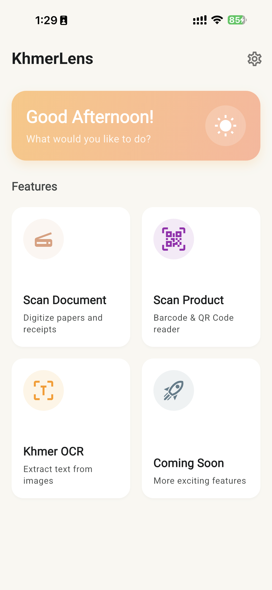

# KhmerLens


A powerful document scanner and OCR application built with Flutter.



## Gets Started

### Prerequisites
- [Flutter SDK](https://flutter.dev/docs/get-started/install) installed on your machine.
- Android Studio or VS Code with Flutter extensions.

### Running Locally
To run the app on a connected device or emulator:
```bash
flutter run
```

---

## Building for Android

### 1. Release APK
To build a standalone APK for side-loading or testing:
```bash
flutter build apk --release
```
**Output:** `build/app/outputs/flutter-apk/app-release.apk`

### 2. App Bundle (Google Play Store)
To build an Android App Bundle (`.aab`) for uploading to the Play Store:
```bash
flutter build appbundle
```
**Output:** `build/app/outputs/bundle/release/app-release.aab`

---

## Signing Configuration

This project is configured to use a **secure signing setup** for release builds.

### Required Files
To build a release version, you must have the following files in the `android/` directory (these are git-ignored for security):
1.  **`android/app/upload-keystore.jks`**: The binary keystore file.
2.  **`android/key.properties`**: A properties file containing the secrets.

**Format of `key.properties`:**
```properties
storePassword=YOUR_STORE_PASSWORD
keyPassword=YOUR_KEY_PASSWORD
keyAlias=upload
storeFile=upload-keystore.jks
```

> **⚠️ IMPORTANT:** Never commit `upload-keystore.jks` or `key.properties` to version control. Keep backups of these files in a secure location. If you lose the keystore, you will not be able to update your app on the Play Store.

## License
© 2025 KR STUDIO. All rights reserved.
